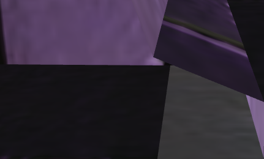
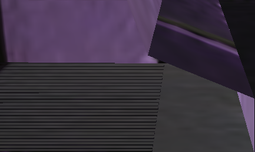
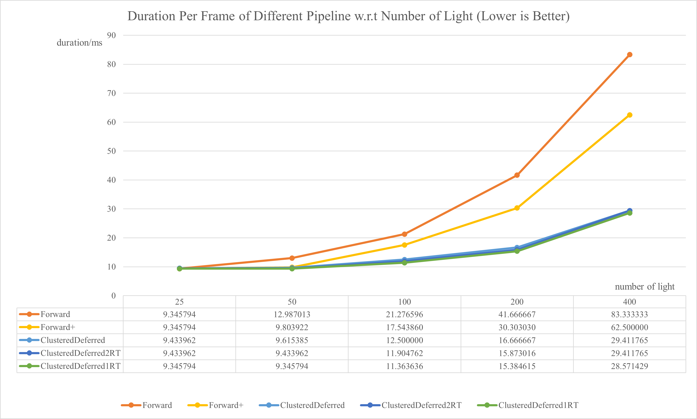
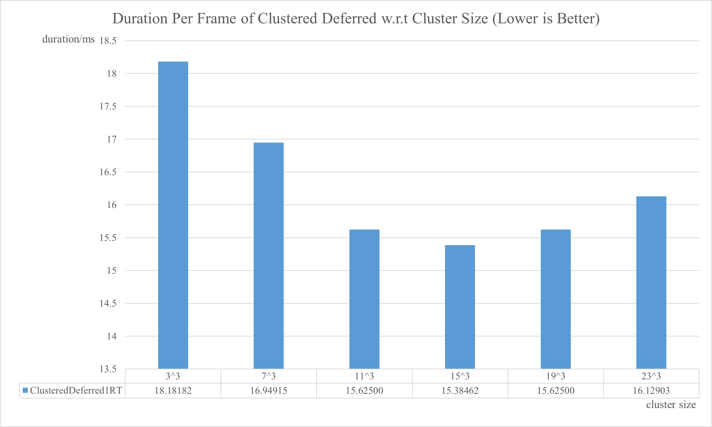
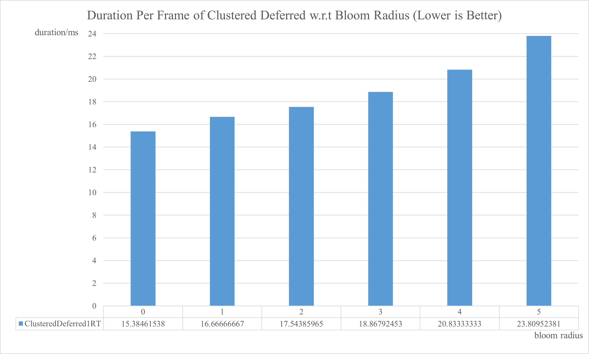

WebGL Forward+ and Clustered Deferred Shading
======================

**University of Pennsylvania, CIS 565: GPU Programming and Architecture, Project 5**

* Xuntong Liang
* Tested on: **Microsoft Edge 95.0.1020.30** on
  Windows 10, i7-10750H @ 2.60GHz 16GB, RTX 2070 Super with Max-Q 8192MB

### Live Online

### Demo Video/GIF

## Features

- Implemented Forward+ rendering pipeline as Clustered Forward.
- Implemented Clustered Deferred rendering pipeline.
- Implemented Blinn-Phong shading in all the pipelines with single specular color.
- Implemented bloom using post-processing box blur.
- Pack values of G-buffer to optimize the performance of deferred rendering.

### Forward+ Rendering

In this project, I implemented Clustered Forward rendering pipeline, which divides the frustum into 3D clusters instead of 2D tiles. 

I divide the frustum in uniform view space, and process the per-cluster light culling by axis-aligned bounding box instead of the actual frustum, which makes the light culling contains fewer computations but may lead to more lights in each cluster.

### Clustered Deferred Rendering

Clustered Deferred rendering pipeline takes the advantage of clustered light culling and traditional deferred shading. Since this pipeline needs the G-buffer, it needs a lot of memory bandwidth, so we can optimize the G-buffer to improve the performance. 

Another disadvantage of deferred rendering is that, even if we consider only opaque objects are in the scene, it is hard to process anti-aliasing with the dependent of the G-buffer.

Some of the artifacts are shown below.

|             Forward             |               Deferred                |
| :-----------------------------: | :-----------------------------------: |
|  |  |

### Blinn-Phong Shading

Blinn-Phong shading includes diffuse (or lambertian) and specular. I apply single specular color and shininess for specular term.

### Bloom

I implemented bloom using post-process box blur. We can get a simple bloom effect by extracting bright colors, blur, and mixing. Since I didn't implement HDR display, I mix the bloom color considering the origin brightness. The brightness can be computed by `dot(color, vec3(0.2126, 0.7152, 0.0722))`.

This process needs more render passes so that there are tradeoffs to get the bloom effect. 

Actually Gaussian blur may have a better visual effect, but it needs more computation to get the weights. 

## Performance Analysis

I tested all the cases with 1880\*1329 screen resolution.

### Number of Light Sources

Because this project doesn't use complex shading models, it only needs positions, normal vectors and colors for shading. In this case, the memory bandwidth seems to be not so critical. 

I tested with several configurations about the number of light sources from 25 to 400. It turns out that the Forward+ is better than Forward, and the Clustered Deferred is better than Forward+. 

The naïve Clustered Deferred rendering (ClusteredDeferred) needs 3 render targets for colors, normal vectors, and positions, respectively. I generate depths instead of positions so that the depth value can be packed into the first two render targets, so with the first optimization (ClusteredDeferred2RT), it needs 2 render targets. Then I use one float to pack the color, omit the z-value of the vector and multiply the sign of the z-value to the one-float color. After this optimization (ClusteredDeferred1RT), it needs one float for color, two floats for normal, and one float for depth, so that it only needs 1 render targets. With fewer render targets for the G-buffer, the performance is slightly improved, even though it needs more computations to extract the actual values of what we need for shading. 

### Cluster Size

I also tested the effect of cluster size in the scene with 200 light sources. It turns out that 15\*15\*15 is the optimal configuration. 

### Bloom

I tested the performance change due to the bloom effect. If the radius equals to 0, then we don't need the extra render pass. Otherwise we need an extra render pass which applies a radius\*radius kernel for box blur. 

This figure shows that the current implementation of the bloom effect costs much with large radius. This process can be optimized by optimizing the blur process. The blur process can be done by A-trous wavelet filter, and two-pass blur. 

## Credits

* [Three.js](https://github.com/mrdoob/three.js) by [@mrdoob](https://github.com/mrdoob) and contributors
* [stats.js](https://github.com/mrdoob/stats.js) by [@mrdoob](https://github.com/mrdoob) and contributors
* [webgl-debug](https://github.com/KhronosGroup/WebGLDeveloperTools) by Khronos Group Inc.
* [glMatrix](https://github.com/toji/gl-matrix) by [@toji](https://github.com/toji) and contributors
* [minimal-gltf-loader](https://github.com/shrekshao/minimal-gltf-loader) by [@shrekshao](https://github.com/shrekshao)
